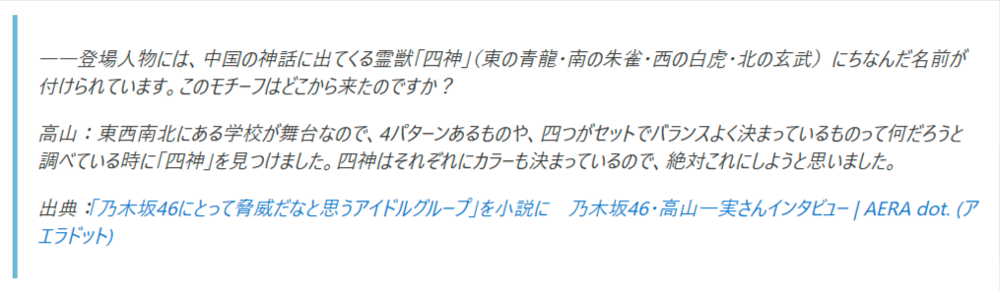
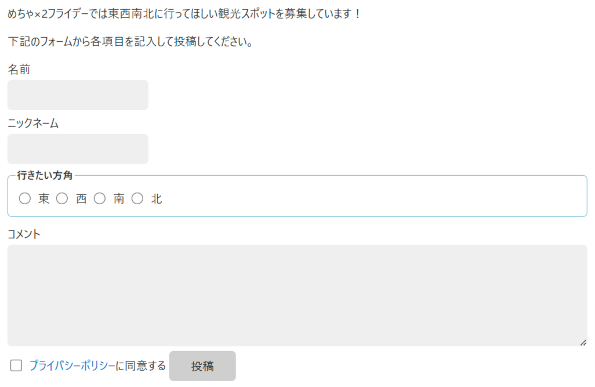
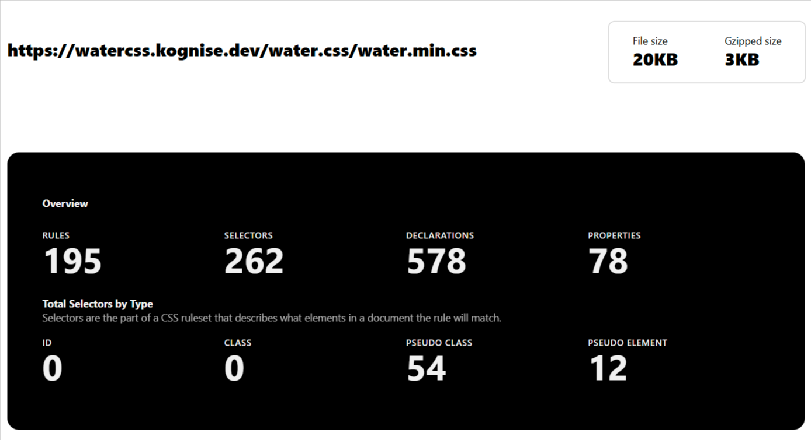
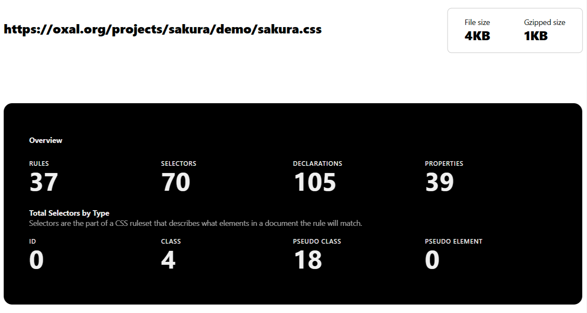
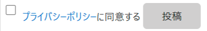
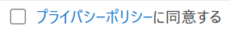

# 東の星 ～Water.css～

リポジトリ：[github.com/kognise/water.css](https://github.com/kognise/water.css)

東ゆうが「ワラーシーエスエス」と読みそうなWater.cssは、簡単なデモページやシンプルな内容のWebサイトを作るときに、良い見た目にするためのライブラリと説明されています。

## 特徴

Water.cssのREADMEには下記の特徴があると書かれています。

- レスポンシブである
- テーマを変えられる
- 古いKindleブラウザーでも動作するほどのブラウザーサポート
- 小さなサイズ
- 美しい
- クラスレス

今回紹介するライブラリとの比較では、下記の特徴があります。

- `:root` 擬似クラスに定義されている変数を使ってスタイルのカスタマイズができる
- `blockquote` 要素の `font-style` 値に `italic` を定義している
- `input` 要素の `display` 値に `block` を定義することで、フォーム要素の縦並び表示を実現している
- 印刷向けのスタイル定義がある
- もっとも多くのルールセット・セレクター・スタイル宣言がされている

それぞれの特徴について詳しく見ていきます。

### `:root` 擬似クラスに定義されている変数を使ってスタイルのカスタマイズができる

Almond.cssやnew.cssと同じく `:root` 擬似クラスに変数が定義されています。変数の値を自分の書いたCSS内で上書きすることで、見た目を変えられます。

[v2.1.1時点のWater.cssのソースコード](https://github.com/kognise/water.css/blob/2.1.1/src/variables-light.css)から引用してきたコードで示すと、下記の変数が定義されています。

```css
:root {
  --background-body: #fff;
  --background: #efefef;
  --background-alt: #f7f7f7;
  --selection: #9e9e9e;
  --text-main: #363636;
  --text-bright: #000;
  --text-muted: #70777f;
  --links: #0076d1;
  --focus: #0096bfab;
  --border: #dbdbdb;
  --code: #000;
  --animation-duration: 0.1s;
  --button-base: #d0cfcf;
  --button-hover: #9b9b9b;
  --scrollbar-thumb: color-mod(var(--button-hover) lightness(+6%));
  --scrollbar-thumb-hover: var(--button-hover);
  --form-placeholder: #949494;
  --form-text: #1d1d1d;
  --variable: #39a33c;
  --highlight: #ff0;
  --select-arrow: svg-load('./assets/select-arrow.svg', fill: #161f27);
}
```

変数の詳細は、[リポジトリのREADME](https://github.com/kognise/water.css?tab=readme-ov-file#theming)の「Theming」内にまとまっています。

### `blockquote` 要素の `font-style` 値に `italic` を定義している

`blockquote` 要素内の文字を斜体で表示するようにした上で、`border` も左側に表示されていて、一目で引用と分かる見た目になっています。



### `input` 要素の `display` 値に `block` を定義することで、フォーム要素の縦並び表示を実現している

sakuraでもフォームが縦並びになるよう `label` 要素に対して `display: block;` が適用されていました。ただ、この方法は `label` 要素内に各要素を入れ子にすることを強制するものでした。せっかく `label` 要素と `input` 要素は入れ子にしなくても良い仕様になっているので、それ、ちゃんと尊重してほしかったなという感じでした。

Water.cssは仕様を尊重しているのか、`input` 要素に対して `display: block;` を適用することでフォーム要素を縦に並べた表示を実現しています。



一方で `type="checkbox"` と `type="radio"` が `input` 要素に対して定義されている場合は、`display: initial;` を適用しているため、横並びに表示したいフォーム関連の要素はちゃんと横並びに表示されます。

### 印刷向けのスタイル定義がある

唯一、印刷時に適用されるスタイル定義があります。適用されるスタイルを挙げると下記の通りになります。

- 背景色を変更している要素に対して `background-color: #ffffff;` を適用
- 前景色を変更している要素に対して `color: #000000;` を適用
- `a` 要素に対して `color: #0000ff;` を適用し、下線を付けるように変更

### もっとも多くのルールセット・セレクター・スタイル宣言がされている

今回紹介しているクラスレスCSS（sakura、Almond.css、Water.css、new.css）の中ではWater.cssがもっともルールセット・セレクター・スタイル宣言の数が多いです。

[CSS Stats](https://cssstats.com/)というWeb上でCSSの内容を解析できるツールを使って、Water.cssで定義されているルールセット・セレクター・スタイル宣言の数を出してみたのが下記の画像です。



78個のプロパティ・195個のルール・262個のセレクター・578個のスタイル定義が存在していることが分かります。

対象的にもっとも少ないsakuraをCSS Statsで解析した結果が下記の画像です。



39個のプロパティ・37個のルール・70個のセレクター・105個のスタイル定義しか存在していないことが分かります。

## 気になる点

### `input` 要素に特定の属性を定義したときに、`input` 要素と `label` 要素を横並びにした場合、チェックボックスの表示が上にずれる

他のライブラリと比較した際に、`input` 要素の `type` 属性に `checkbox` または `radio` が定義されていると、`label` 要素を並べたときにチェックボックスの表示が上にずれることです。



これに関しては `input` 要素と `label` 要素の両方に `vertical-align: text-top;` を定義すれば、横並びで表示したときに表示位置が揃います。



### `body` 要素の `font-family` に `system-ui` が定義されている

`font-family` の値にさまざまなフォントが定義されています。ただ一番先頭が `system-ui` のため `Yu Gothic UI` が適用される環境（主にWindows）もあります。

この `Yu Gothic UI` が曲者で、Chrome系ブラウザーでかぎ括弧を連続して表示した場合（たとえば「あああ」「いいい」など）に、かぎ括弧同士が重なって表示されます。

[「Yu Gothic UI」フォントの鍵括弧、繋げるとブラウザ表示で重なる問題を調べてみた - 俵のメモ帳](https://tawara-memo.hatenablog.com/entry/2024/10/12/174432)という記事によると、割と最近実装されたCSSのプロパティ `text-spacing-trim` のデフォルト値と、Yu Gothic UI内部の設定の組み合わせによって引き起こされている問題のようです。

游ゴシック自体、Windowsでは `font-weight: normal;` の状態で使うと文字の線の太さが細くて見づらかったり、OSレベルで標準インストールされているWindows以外ではフィンガープリントの観点で使えなくなる可能性があったり、クセがあるフォントですが、上手くスタイルを適用すればメイリオと比較してスッキリした見た目になるので、嫌なやつかもしれないけど、そういうところも、そうじゃないところもあるよ、という感じです。

### 更新されていない

また重要な点として、2021年8月頃から更新が途絶えていることが挙げられます。

[This repository is not currently being maintained](https://github.com/kognise/water.css/issues/351)というissueが挙がっているように、元々の作者がリポジトリをメンテナンスしておらず、IssueやPull Requestに対して何も行動しない状態が続いています。

今回紹介するライブラリではnew.cssも更新が途絶えていますが、new.cssはアナウンスをしないまま更新が途絶えているのに比べて、Water.cssは作者ではないとはいえPull Requestのマージ権限を持ったメンテナーがアナウンスをしているため、ある程度の公式感を伴ったアナウンスがされていると言えます。

とはいえ、更新が途絶えていることには変わりないため、将来的にForkして使う可能性も検討したほうが良いでしょう。
