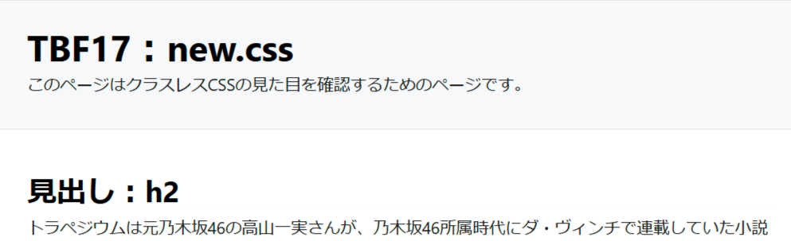
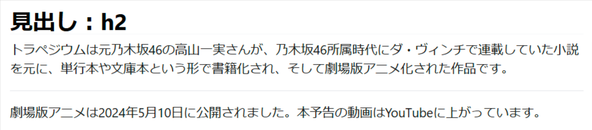
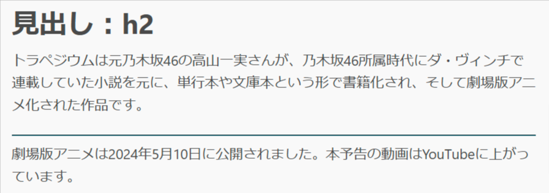
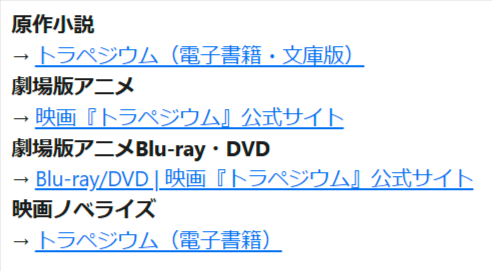
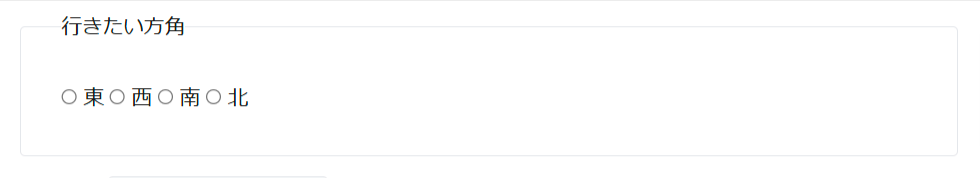
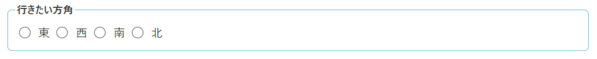

# 北の星 ～new.css～

- リポジトリ：[github.com/xz/new.css](https://github.com/xz/new.css)
- サンプル：[https://o2project.github.io/tbf17/examples/newcss.html](https://o2project.github.io/tbf17/examples/newcss.html)

new.cssは、4.8KBというCSSのサイズの小ささを売りにしているライブラリです。

## 特徴

new.cssのREADMEには、シンプルなブログや自己紹介ページなどで、もっともよく活用できると書かれています。このあたりは本書籍の「はじめに」内「クラスレスCSSの活用」で書いた通りの用途となりそうです。

今回紹介するライブラリとの比較では、下記の特徴があります。

- `:root` 擬似クラスに定義されている変数を使ってスタイルのカスタマイズができる
- `header` 要素に対してスタイル定義がされている
- sakuraと比較して、多くの要素にスタイルが適用されている
- 背景色と前景色のコントラスト比がもっとも高い

### `:root` 擬似クラスに定義されている変数を使ってスタイルのカスタマイズができる

Water.cssやAlmond.cssと同じく `:root` 擬似クラスに変数が定義されています。変数の値を自分の書いたCSS内で上書きすることで、見た目を変えられます。

[v1.1.3時点のnew.cssのソースコード](https://github.com/xz/new.css/blob/v1.1.3/new.css)から引用してきたコードで示すと、下記の変数が定義されています。

```css
:root {
  --nc-font-sans: 'Inter', -apple-system, BlinkMacSystemFont, 'Segoe UI', Roboto, Oxygen, Ubuntu, Cantarell, 'Open Sans', 'Helvetica Neue', sans-serif, "Apple Color Emoji", "Segoe UI Emoji", "Segoe UI Symbol";
  --nc-font-mono: Consolas, monaco, 'Ubuntu Mono', 'Liberation Mono', 'Courier New', Courier, monospace;

  /* Light theme */
  --nc-tx-1: #000000;
  --nc-tx-2: #1A1A1A;
  --nc-bg-1: #FFFFFF;
  --nc-bg-2: #F6F8FA;
  --nc-bg-3: #E5E7EB;
  --nc-lk-1: #0070F3;
  --nc-lk-2: #0366D6;
  --nc-lk-tx: #FFFFFF;
  --nc-ac-1: #79FFE1;
  --nc-ac-tx: #0C4047;

  /* Dark theme */
  --nc-d-tx-1: #ffffff;
  --nc-d-tx-2: #eeeeee;
  --nc-d-bg-1: #000000;
  --nc-d-bg-2: #111111;
  --nc-d-bg-3: #222222;
  --nc-d-lk-1: #3291FF;
  --nc-d-lk-2: #0070F3;
  --nc-d-lk-tx: #FFFFFF;
  --nc-d-ac-1: #7928CA;
  --nc-d-ac-tx: #FFFFFF;
}
```

変数の詳細は、[new.cssのWiki](https://github.com/xz/new.css/wiki/Customizing-Themes)の「Customizing Themes」内にまとまっています。

### `header` 要素に対してスタイル定義がされている

今回紹介するライブラリでは唯一 `header` 要素に対してスタイルが適用されています。スタイル自体はページのヘッダーによく適用されていそうなスタイルとなっているため、癖はないと言えます。



### sakuraと比較して、多くの要素にスタイルが適用されている

同じく軽量なライブラリであるsakuraと比較すると、new.cssのほうがスタイル適用されている要素は多いです。new.cssは56個の要素に対してスタイルが適用されているのに対して、sakuraは33個の要素に絞られています。

「南の星 ～sakura～」の章で書きましたが、HTMLの要素は、過去に存在したが今は非推奨となった要素を除くと、2024年10月時点で114個の要素が存在します。

なのでnew.cssは約半分の要素に対してスタイル適用がされていることになります。

### 背景色と前景色のコントラスト比がもっとも高い

new.cssは背景色に `#ffffff` と前景色に `#000000` が適用されている唯一のライブラリです。



コントラスト比をもっとも抑えているsakuraを適用したページの画像は下記の通りですが、比較するとかなりコントラスト比が異なります。



## 気になる点

### `dt` 要素が太字になっている

唯一 `dt` 要素に `font-weight: 700;` が指定されています。既定の状態だと `dd` 要素には `margin-inline-start` が適用されているので `dt` 要素と `dd` 要素で文字の太さを変更する必要はないですが、後述する `dd` 要素に対して `::before` 疑似要素を使って右矢印を表示するようにしている関係上、`dd` 要素と区別する意味で太字にしているかもしれません。



ただ `dd` 要素のスタイル定義と合わせて、好みが分かれそうなスタイル定義です。

### `dd` 要素の `::before` 疑似要素の `content` プロパティの値に右矢印が定義されている

前述の `dt` 要素に続いて `dd` 要素も他にはない独自のスタイル定義として、`::before` 疑似要素の `content` プロパティの値に右矢印が定義されています。


個人的にはこういう表現もありだとは思いますが、こちらもまた好みが分かれそうなスタイル定義です。

### `fieldset` 要素の `padding` が広い

他のライブラリと比較して、`fieldset` 要素に対して適用されている `padding` が広めとなっています。



下記の画像はWater.cssを使って `fieldset` 要素を表示したときの見た目ですが、new.cssと比較して明らかに `padding` が狭いです。



### 更新されていない

また重要な点として、2021年10月頃から更新が途絶えていることが挙げられます。

Water.cssも同じく更新が途絶えていますが、こちらは作者以外でメンテナーとして関わっていた人が、リポジトリの状況についてIssueを作る形で回答していました。

しかしnew.cssはアナウンスもなく更新が途絶えている状態です。

もしnew.cssを使う場合は、将来的にForkして使う可能性も検討したほうが良いでしょう。
