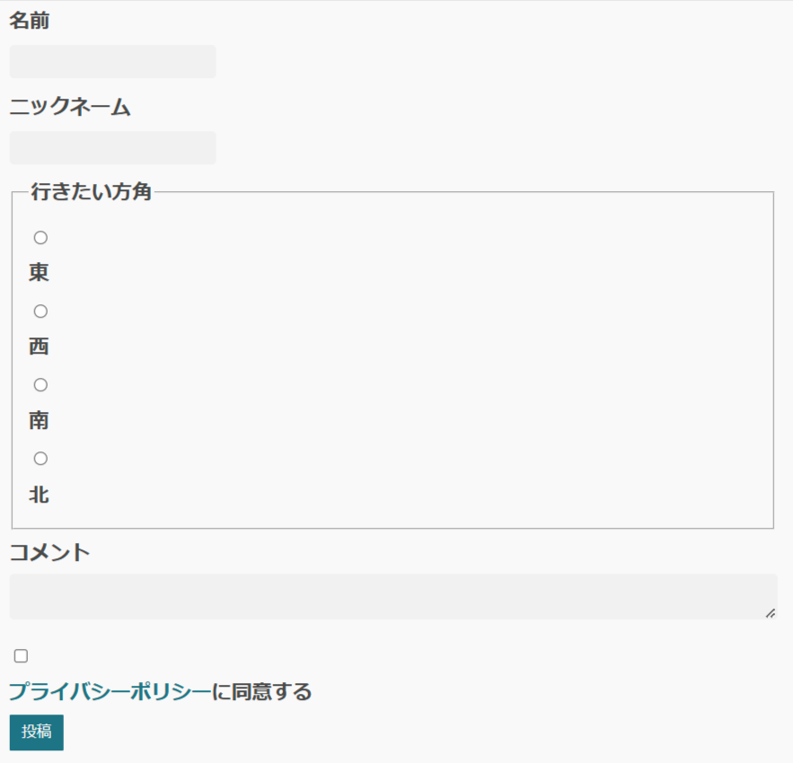
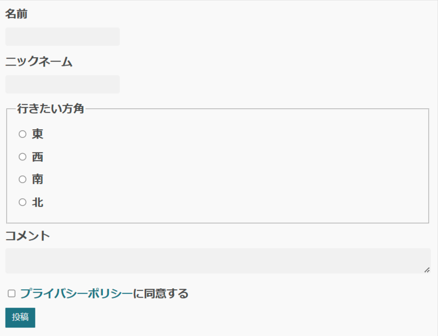
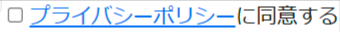
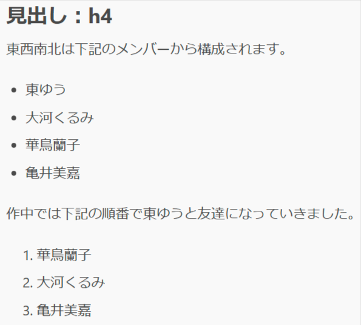

# 南の星 ～sakura～

- リポジトリ：[github.com/oxalorg/sakura](https://github.com/oxalorg/sakura)
- サンプル：[https://o2project.github.io/tbf17/examples/sakura.html](https://o2project.github.io/tbf17/examples/sakura.html)

sakuraは、90年代のような見栄えの悪いWebサイトを、sakuraが提供するCSSを読み込むだけででモダンなWebサイトにするライブラリと説明されています。

ライトモードでは桜っぽい要素はありませんが、ダークモードの一部テーマでは、線やボタンの背景色に桜っぽい色が適用されます。

## 特徴

sakuraのREADMEには下記の特徴があると書かれています。

- Sassによる独自テーマ作成
- ダークモード用のCSSを読み込むことでダークモードに対応

今回紹介するライブラリとの比較では、下記の特徴があります。

- Webページを作る上でよく使われるHTMLの要素に限定してスタイルが適用されている
- `body` 要素の `max-width` の値の単位に、唯一 `em` 単位が使われている
- `body` 要素の `background-color` の値に、唯一 `#ffffff` ではなく `#f9f9f9` が定義されている
- `tr` 要素に対して `background-color` が適用されていない
- new.cssと同じく全てのスタイル定義が1つのファイルに書かれている
- Almond.cssと同じくSassが使われている

それぞれの特徴について詳しく見ていきます。

### Sassによる独自テーマ作成

[v1.5.0時点のsakuraのソースコード](https://github.com/oxalorg/sakura/blob/1.5.0/scss/sakura.scss)から引用してきたコードで示すと、下記の変数が定義されています。

```scss
$color-blossom: #1d7484;
$color-fade: #982c61;

$color-bg: #f9f9f9;
$color-bg-alt: #f1f1f1;

$color-text: #4a4a4a;
$font-size-base: 1.8rem;

$font-family-base: -apple-system, BlinkMacSystemFont, "Segoe UI", Roboto, "Helvetica Neue", Arial, "Noto Sans", sans-serif;
$font-family-heading: $font-family-base;

@import "main";
```

該当のファイルは[scssディレクトリ](https://github.com/oxalorg/sakura/tree/1.5.0/scss)内に存在しているので、適当なファイルを複製して、変数の値を書き換えた上でビルドすれば、自分好みのテーマを作成できます。

### Webページを作る上でよく使われるHTMLの要素に限定してスタイルが適用されている

sakuraは今回紹介するクラスレスCSSライブラリと比較して、CSS内で定義されているHTML要素の定義が少ないです。

new.cssも同じくHTML要素に対するスタイル定義が少ないです。ただnew.cssとsakuraを比較した場合も、new.cssは56個の要素に対してスタイルが適用されているのに対して、sakuraは33個の要素にしかスタイルが適用されていません。

HTMLの要素は、過去に存在したが今は非推奨となった要素を除くと、2024年10月時点で114個の要素が存在します。約1/4の要素にのみスタイル適用されているという点でだいぶ割り切っています。

またメディアクエリー・属性セレクター・擬似クラス・疑似要素・子結合子・子孫結合子などの定義も少ないため、minifyされたCSSを展開した場合、new.cssと比較して約90行分コード量が少ないです。

### `body` 要素の `max-width` の値の単位に、唯一 `em` が使われている

sakura独自の特徴として、`body` 要素に定義されている `max-width` の値の単位に `em` が使われている点があります。

これによってブラウザーの設定で文字サイズを変更した場合、その値に応じて `max-width` の値が可変します。

文字サイズを拡大するよう設定を変更した場合はページの表示領域が狭くなります。そのため `max-width` の値の単位に `em` や `rem` を使うのは、表示領域に対するページ表示の最適化──たとえば2カラムで表示しているページを1カラム表示にして、メインコンテンツの表示領域を確保するといった意味で良い考えかもしれません。

### `body` 要素の `background-color` の値に、唯一 `#ffffff` ではなく `#f9f9f9` が定義されている

こちらもsakura独自の特徴として、`body` 要素に定義されている `background-color` の値で `#f9f9f9` が使われている点があります。

コントラスト比を高めすぎると視覚過敏の特性を持つ人にとってはまぶしく感じ、それによって目が疲れたり不快感を感じたりする場合があります。

sakuraでは `color` の値に定義されている `#4a4a4a` と合わせて、背景色と前景色のコントラスト比を高めすぎないことで、目に優しい見た目となっています。

### `tr` 要素に対して `background-color` が定義されていない

今回紹介するライブラリの中では、唯一 `tr` 要素に `background-color` が定義されていません。これによりテーブル内のどの列も目立つことなく、同じように表示されます。

ただし `td` 要素と `th` 要素に対して設定されている `border-color` のコントラストが背景色と比較すると低いため、環境によってはセル間の区切りが見づらくなります。

### Almond.cssと同じくSassが使われている

sakuraではAlmond.cssと同じくSassが使われています。

ただしそれぞれのライブラリでSassの用途は異なります。Almond.cssではスタイル定義を個々のファイルに分割するためSassが使われていますが、sakuraではスタイルのカスタマイズ目的でSassが使われています。

### new.cssと同じく全てのスタイル定義が1つのファイルに書かれている

sakuraではスタイルのカスタマイズ用にSassが使われていますが、適用するスタイルの定義は1つのファイルにまとまっています。

スタイル定義が少ないため、1つのファイルにまとまっていたほうが元のソースコードが読みやすいと判断して、1つのファイルにまとめたのだと思います。

## 気になる点

### `:root` 擬似クラスに変数が定義されてないため、見た目を変更したい場合にSassを使う必要がある

今回紹介するAlmond.cssやWater.css、new.cssといったライブラリでは `:root` 擬似クラスに変数が定義されています。そのため別途ツールをインストールしなくても、`:root` 擬似クラス内で変数の値を上書きしたCSSを `link` 要素で読み込めば、見た目を変更できます。

一方でsakuraはSassの変数を使って見た目を変更するための変数が定義されています。なので見た目を変更したい場合は、Node.jsとnpmなどのパッケージマネージャーをインストールした上で、Sassとsakuraもインストールして、Sassのファイルを書き換えた上でビルドしてCSSを出力する作業が必要になります。

`:root` 疑似クラスに変数が定義されていないぶん、ファイルサイズを軽くできているという利点もありますが、見た目を変更する手間は他のライブラリよりかかります。

### `label` 要素に `display: block;` が適用されている

フォームを縦並びに表示するため `label` 要素に `display: block;` が適用されていますが、その影響で `label` 要素内にフォームの要素を入れ子にすることを強いられます。たとえば下記のように `label` 要素と `input` 要素を別に書くのは推奨されません。

```html
<fieldset>
  <legend>行きたい方角</legend>
  <input type="radio" name="direction" id="east" value="east" />
  <label for="east">東</label>
  <input type="radio" name="direction" id="west" value="west" />
  <label for="west">西</label>
  <input type="radio" name="direction" id="south" value="south" />
  <label for="south">南</label>
  <input type="radio" name="direction" id="north" value="north" />
  <label for="north">北</label>
</fieldset>
```

このHTML構造の場合、フォームが不格好な見た目になってしまいます。



一応 `label` 要素内に `input` 要素を入れ子にするとマシな見た目になります。

```html
<fieldset>
  <legend>行きたい方角</legend>
  <label>
    <input type="radio" name="direction" value="east" />
    東
  </label>
  <label>
    <input type="radio" name="direction" value="west" />
    西
  </label>
  <label>
    <input type="radio" name="direction" value="south" />
    南
  </label>
  <label>
    <input type="radio" name="direction" value="north" />
    北
  </label>
</fieldset>
```



ただせっかく `label` 要素と `input` 要素を別に書ける仕様になっているのに、それができないのは少しモヤッとします。まあsakuraも悪気があったわけじゃないんでしょう。

`label` 要素内に `input` 要素やテキストを入れ子にすることを強制した場合、下記の画像のようにチェックボックスとリンク、テキストを横並びにするようなUIで困ることになります。



というのも `label` 要素をクリックした場合はフォーム要素にフォーカスされますが、`label` 要素内に `a` 要素などのユーザーが操作できる要素（インタラクティブ要素）を入れ子にすると、下記のようにクリックしたときの挙動が異なることになって、使う人の混乱を招く恐れがあるためです。

- `a` 要素をクリックしたときは `href` 属性で指定しているリンク先に遷移する
- テキストの部分をクリックしたときはフォーム要素にフォーカスする

### `ol` 要素に独自のスタイルが適用されていない

sakura独自のスタイル定義が `ol` 要素にはないため、ブラウザー既定のCSSが適用されています。

このため `ul` 要素と並べたときに `ul` 要素の先頭の記号と `ol` 要素の先頭の数字がきちんと揃いません。


