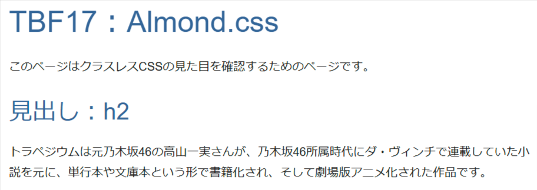
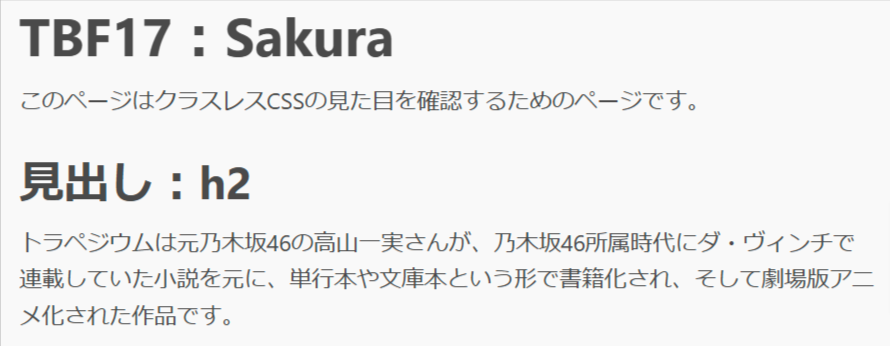
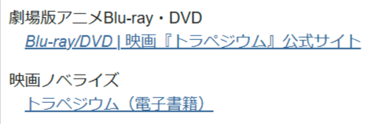
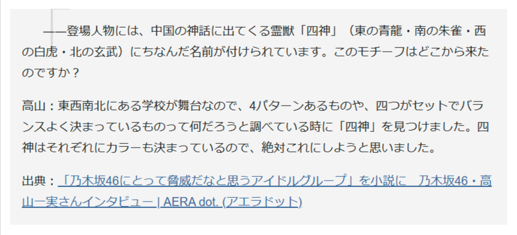
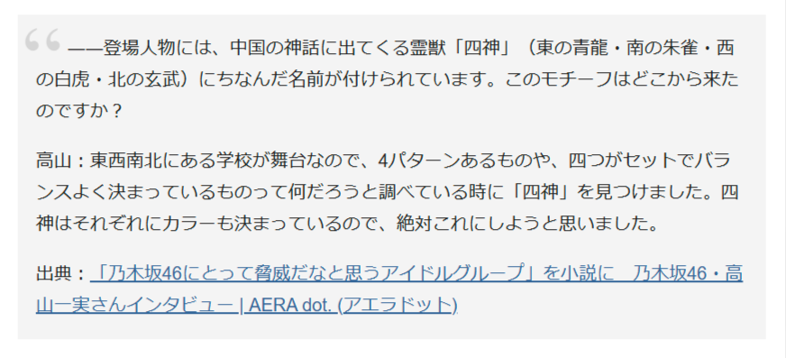

# 西の星 ～Almond.css～

リポジトリ：[github.com/alvaromontoro/almond.css](https://github.com/alvaromontoro/almond.css)

Almond.cssはブラウザー間で見た目が異ならないよう正規化すると共に、独自のスタイルを適用するライブラリだと説明されています。

## 特徴

Almond.cssのREADMEには下記の特徴があると書かれています。

- タグのみ使い、`class` 属性や `id` 属性に対するスタイルの適用はない
- ブラウザ間の表示互換性
- CSS variablesの値とHSLの色表現を変更できる
- レスポンシブで、アクセシブルかつユーザブル
- gzip圧縮したときにファイルサイズが3KB以内に収まる
- シンプルさの維持

今回紹介するライブラリとの比較では、下記の特徴があります。

- `:root` 擬似クラスに定義されている変数を使ってスタイルのカスタマイズができる
- `font-family` の値に定義されているフォントの数がもっとも少ない
- 見出し要素に `color` を適用している
- メインカラーとサブカラーの値定義にHSLを使っている

それぞれの特徴について詳しく見ていきます。

### `:root` 擬似クラスに定義されている変数を使ってスタイルのカスタマイズができる

Water.cssやnew.cssと同じく `:root` 擬似クラスに変数が定義されています。変数の値を自分の書いたCSS内で上書きすることで、見た目を変えられます。

[v1.2.2時点のAlmond.cssのソースコード](https://github.com/alvaromontoro/almond.css/blob/v1.2.2/src/general/variables.scss)から引用してきたコードで示すと、下記の変数が定義されています。

```css
:root {
  /* Colors */
  --primaryH: 210;
  --primaryS: 50%;
  --primaryL: 40%;
  --primary-bg: #fff;
  --secondaryH: 0;
  --secondaryS: 0%;
  --secondaryL: 13%;
  --secondary-bg: #fff;

  /* Font */
  --font-family: Helvetica, Arial, sans-serif;
  --font-size-root: 16px;
  --font-weight-bolder: 700;
  --font-weight-bold: 400;
  --font-weight-normal: 200;
  --font-weight-thin: 100;
  --line-height: 1.75rem;
  --heading-margin: 1.5rem 0 1rem;

  /* Inputs */
  --border-radius: 2px;

  /* Status */
  --error: #d00;
  --warning: #ec0;
  --info: #369;
  --correct: #080;

  /* Calculated colors */
  --primary: hsl(var(--primaryH), var(--primaryS), var(--primaryL));
  --primary-bright: hsl(var(--primaryH), calc(var(--primaryS) * 1.25), 90%); // #7ef;
  --primary-transparent: hsla(var(--primaryH), var(--primaryS), var(--primaryL), 0.05);
  --primary-dark: hsl(var(--primaryH), var(--primaryS), calc(var(--primaryL) * 0.5));
  --primary-darker: hsl(var(--primaryH), var(--primaryS), calc(var(--primaryL) * 0.2));
  --primary-light: hsl(var(--primaryH), var(--primaryS), 75%);
  --primary-lighter: hsl(var(--primaryH), var(--primaryS), 96%);
  --secondary: hsl(var(--secondaryH), var(--secondaryS), var(--secondaryL));
  --secondary-transparent: hsl(var(--secondaryH), var(--secondaryS), var(--secondaryL), 0.05);
  --secondary-dark: hsl(var(--secondaryH), var(--secondaryS), calc(var(--secondaryL) * 0.5));
  --secondary-darker: hsl(var(--secondaryH), var(--secondaryS), calc(var(--secondaryL) * 0.2));
  --secondary-light: hsl(var(--secondaryH), var(--secondaryS), 75%);
  --secondary-lighter: hsl(var(--secondaryH), var(--secondaryS), 96%);
}
```

変数の詳細は、[リポジトリのREADME](https://github.com/alvaromontoro/almond.css?tab=readme-ov-file#theming)の「Theming」内にまとまっています。

### `font-family` の値に定義されているフォントの数がもっとも少ない

多く使われているゴシック体のフォントに限ると下記の定義が全てです。

```css
font-family: Helvetica, Arial, sans-serif;
```

といっても他と比較しないとどれだけ少ないのか分からないので、今回紹介するライブラリで定義されている `font-family` の値を一覧にします。なお全てゴシック体のフォントに限定しており、セリフ体やソースコードに対して適用されている `font-family` は対象外としています。

- sakura: `font-family: -apple-system, BlinkMacSystemFont, "Segoe UI", Roboto, "Helvetica Neue", Arial, "Noto Sans", sans-serif;`
- Water.css: `font-family: system-ui,-apple-system,BlinkMacSystemFont,Segoe UI,Roboto,Oxygen,Ubuntu,Cantarell,Fira Sans,Droid Sans,Helvetica Neue,Segoe UI Emoji,Apple Color Emoji,Noto Color Emoji,sans-serif;`
- new.css: `font-family: 'Inter',-apple-system,BlinkMacSystemFont,'Segoe UI',Roboto,Oxygen,Ubuntu,Cantarell,'Open Sans','Helvetica Neue',sans-serif,"Apple Color Emoji","Segoe UI Emoji","Segoe UI Symbol"`

こうして比較するとAlmond.cssの `font-family` に定義されているフォントの数が圧倒的に少ないと分かります。

「ロボコンはデザインだけだと全国で勝てないので、もっと上を目指して努力したい」という大河くるみの精神が現れているかもしれません。

### 見出し要素に `color` を適用している

`font-family` では定義されているフォントの数で圧倒的な少なさを見せましたが、見出し要素に唯一 `color: hsl(210, 50%, 40%);` を適用しているのがAlmond.cssです。



sakuraと比較してみると分かるかもしれません（白黒ページだと分かりづらいかもしれません……）。



### メインカラーとサブカラーの値定義にHSLを使っている

他のライブラリと違う点として、メインカラーとサブカラーがHSLの値で指定するようになっていることが挙げられます。

`:root` 擬似クラスに定義された変数のうち、関連する変数だけを抜粋すると下記の部分が該当します。

```css
:root {
  --primaryH: 210;
  --primaryS: 50%;
  --primaryL: 40%;
  --secondaryH: 0;
  --secondaryS: 0%;
  --secondaryL: 13%;
}
```

HSLは色相（Hue）・彩度（Saturation）・輝度（Lightness）で色を表すもので、色相を変えるだけで彩度と輝度が同じだが違う色にできたり、白・グレー・黒といった変化が輝度の値を調整するだけでできたりと、一般的によく使われる16進値と比較して、色のトーン合わせなどがやりやすい利点があります。

もしかしたらHSLを使った可能性を試したいと思って、このような指定にしたのかもしれません。

## 気になる点

### ダークモードが実装されていない

他のライブラリと比較した際に、ダークモードを唯一実装していないライブラリとなっています。このことは気になる人がいるかもしれません。

### `dd` 要素に対して `font-style: italic;` が適用されている



### `html` 要素の `lang` 属性の値によっては、`blockquote` 要素内が意図しない表示になる

`blockquote` 要素の `::before` 疑似要素に指定している値が `open-quote` となっていますが、`html` 要素の `lang` 属性に定義されている値によって表示される記号が異なります。

たとえば `html` 要素の `lang` 属性に `ja` の値を定義した場合は、かぎ括弧が引用符として使われます。この状態でAlmond.cssを読み込んで `blockquote` 要素を使うと、`blockquote` 要素内でかぎ括弧の始まりが変な位置に表示されます。



おそらく `html` 要素の `lang` 属性に `en` の値を定義した場合を想定していそうなので、`blockquote` 要素の `::before` 疑似要素に対して、下記のように `quotes` プロパティを使ってダブルクオーテーションを表示するよう定義すると良いでしょう。

```css
blockquote::before {
  quotes: "“""”";
}
```

上記のスタイルを適用すると、`blockquote` 要素内で引用符が正しい位置に表示されます。



大河くるみ自身は英語が苦手と原作小説で書かれていますが、`html` 要素の `lang` 属性が `en` などでないと `blockquote` 要素内の表示がデフォルトの状態だとおかしくなるのは皮肉と言えそうです。
